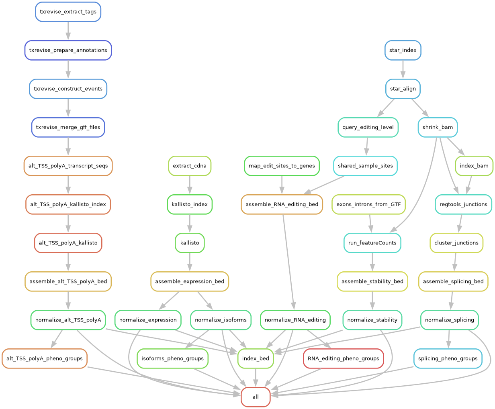
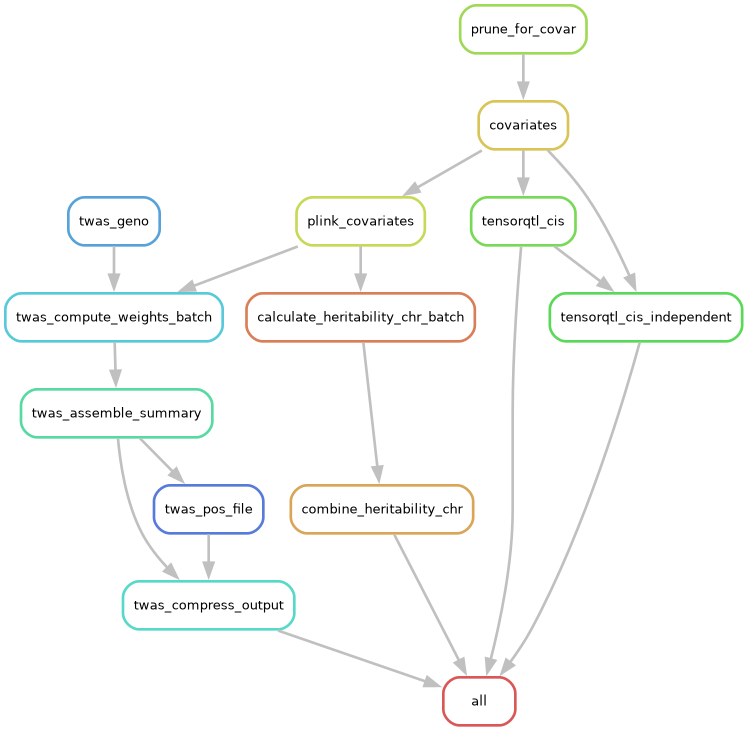

# Pantry

Pantry (PAN-TRanscriptomic phenotYping) is a framework for generating multimodal transcriptomic phenotypes from RNA-Seq and applying them to genetic analyses. The goal is to make genetic analyses as easy to perform with a multitude of transcriptomic phenotype modalities as it is with gene expression alone.

**Contact us** if you have a method for an additional modality that you would like to add to Pantry. Your collaboration will result in authorship on a subsequent Pantry publication, and Pantry users will be instructed to cite your original study every time they use the results in a publication.

The guide below begins with software environment setup, followed by a run-through with a small example dataset to test the setup and demonstrate the overall structure, and finally descriptions of the code and expected file formats so you can run Pantry on real datasets.

## Setup

Clone or download the repository:

```sh
git clone https://github.com/PejLab/Pantry.git
```

Install dependencies for the phenotyping pipeline. [Miniconda](https://docs.conda.io/en/latest/miniconda.html) is recommended for installation and management of these programs. A conda environment specification is provided in `phenotyping/environment.yml`:

```sh
cd Pantry/phenotyping
conda env create -n pantry --file environment.yml
conda activate pantry
```

### Set up Snakemake

General guides to using the [Snakemake](https://snakemake.github.io/) workflow management system can be found online to learn its features. It can handle many execution needs such as threads, computational resources, and automatic cluster job submission. You can specify a profile that determines how steps get run (this is different from the Pantry project config files in `phenotyping/` and `pheast/`). Here is an example profile config for use on a computing cluster with slurm scheduling:

`~/.config/snakemake/slurm/config.yaml`:

```yaml
executor: slurm
default-resources:
  runtime: "4h"
  mem_mb: 8000
  slurm_partition: "our-cpu-partition"
  slurm_account: "our-cpu-account"
set-resources:
  tensorqtl_cis:
    slurm_partition: "our-gpu-partition"
    slurm_account: "our-gpu-account"
    slurm_extra: "'--gres=gpu:1'"
  tensorqtl_cis_independent:
    slurm_partition: "our-gpu-partition"
    slurm_account: "our-gpu-account"
    slurm_extra: "'--gres=gpu:1'"
  tensorqtl_trans:
    slurm_partition: "our-gpu-partition"
    slurm_account: "our-gpu-account"
    slurm_extra: "'--gres=gpu:1'"
use-conda: true
latency-wait: 60
```

This uses snakemake v8 or higher and the `snakemake-executor-plugin-slurm` plugin. The `tensorqtl` steps should be run on GPU for reasonable runtime, so they are specified by name here to override the default resources. Adjust as needed for your cluster. Additional resources are specified within some of the snakemake rules, which are passed to slurm when those jobs are submitted. Alternatively, you can run snakemake on an interactive node.

## Run on test data

Before running Pantry on your data, we recommend testing on our test data to ensure the software environment is set up and the pipeline can run successfully.

The test dataset for the phenotyping stage includes reads from 16 Geuvadis samples, subsetted to those that would map to the first 2 Mb of `chr1`. Download [test_input_phenotyping.tar.gz](https://www.dropbox.com/scl/fi/5c4yjrqji9catsazc8nxd/test_input_phenotyping.tar.gz?rlkey=jsppnzu4cdls9fp5z3xxm1i37&dl=0) to `/`, make sure there is no existing `input` directory with important files in it, and then try running Snakemake:

```sh
wget -O test_input_phenotyping.tar.gz "https://www.dropbox.com/scl/fi/5c4yjrqji9catsazc8nxd/test_input_phenotyping.tar.gz?rlkey=jsppnzu4cdls9fp5z3xxm1i37&dl=0"
tar -xzvf test_input_phenotyping.tar.gz
rm test_input_phenotyping.tar.gz
snakemake -j1 -n
```

The `-n` flag makes it a dry run, just printing which steps would run without executing them. If it does that successfully, remove the `-n` flag to actually run the pipeline. For any snakemake run where you'd need to submit large steps as jobs, add `--profile slurm` (using the name where you placed the config file above).

The second stage of Pantry, Pheast, applies the RNA phenotypes to downstream genetic analyses, and operates in its own project directory. For its dependencies, you can either make a `pheast` environment using `pheast/environment.yml`, or install those dependencies in the existing `pantry` environment.

You can then download and run test data for the Pheast stage. Since these genetic analyses can run into problems when run with too few samples, the test data for Pheast includes Pantry phenotypes for 200 genes for one non-grouped (`expression`) and one grouped (`alt_polyA`) modality, all on `chr1`, for 445 Geuvadis samples, along with their genotypes subsetted to `chr1`. Download [test_input_pheast.tar.gz](https://www.dropbox.com/scl/fi/5k2ybqyrtmjll2ig6nnxv/test_input_pheast.tar.gz?rlkey=yzybnhb60b3yxoebrhsoaoumz&dl=0) to Pheast (or your copy of that directory), make sure there is no existing `input` directory with important files in it, and then try running Snakemake:

```sh
cd ../pheast
wget -O test_input_pheast.tar.gz "https://www.dropbox.com/scl/fi/5k2ybqyrtmjll2ig6nnxv/test_input_pheast.tar.gz?rlkey=yzybnhb60b3yxoebrhsoaoumz&dl=0"
tar -xzvf test_input_pheast.tar.gz
rm test_input_pheast.tar.gz
snakemake -j1 -n
```

## Description

Consult these descriptions of the Pantry code and expected file formats to run Pantry on your data.

### Code

The `phenotyping/` directory is a template for phenotyping one dataset (e.g. tissue). To run Pantry on a dataset, copy the contents of `phenotyping/` to a new directory that you can write to. Your project directory now contains all the data processing code, so that if you modify it or add custom modalities, you have a record of it that stays with the results and is not automatically changed by Pantry updates or your other Pantry runs. The `pheast/` template directory works similarly for the second stage of the pipeline.
 
Currently Pantry generates RNA phenotypes for six modalities, grouped into four Snakemake modules in `steps/` that run the following tools:

- `alt_TSS_polyA.smk`: Alternative TSS and polyA site usage, quantified using [txrevise](https://github.com/kauralasoo/txrevise) followed by [kallisto](https://pachterlab.github.io/kallisto/).
- `expression.smk`: Gene expression and isoform ratio, quantified using [kallisto](https://pachterlab.github.io/kallisto/). Isoform-level abundances are summed per gene to get gene expression abundances. The same isoform-level abundances are normalized per gene to get isoform proportions.
- `splicing.smk`: Intron excision ratio, quantified using [RegTools](https://regtools.readthedocs.io/en/latest/) followed by [leafCutter](https://davidaknowles.github.io/leafcutter/).
- `stability.smk`: RNA stability, quantified using [Subread featureCounts](http://subread.sourceforge.net/) to count reads from constitutive exons and all introns and using their ratio.

Snakemake looks at the inputs and outputs for each rule and figures out the order and number of times to run each step. Pantry includes sensible defaults for this set of tools, but you can edit the commands and add new modalities.



### Config file

The config file is a file in YAML format specifying general parameters, input files, and modalities to generate. `phenotyping/` includes a default config, which is for the above example dataset above, and must be customized for your data:

```yaml
## Raw RNA-Seq data
paired_end: True
read_length: 75
fastq_dir: input/fastq
fastq_map: input/fastq_map.txt
...
```

### Input files

Some phenotypes are extracted from raw sequences (e.g. using kallisto), while others are extracted from aligned reads. Pantry input sequences must be in FASTQ format. If you only have BAM files, you can extract FASTQ from them, e.g. using [`run_SamToFastq.py`](https://github.com/broadinstitute/gtex-pipeline/blob/master/rnaseq/src/run_SamToFastq.py).

Pantry will generate its own BAM files from the FASTQ files using the reference files. The sequences themselves will be removed from the new BAM files, so they will be smaller than typical BAM files. If you are sure your existing BAM files are compatible with the reference files, you can symlink to them in intermediate directory, named as expected by the pipeline (either as the STAR output or the final, shrunken BAM files), and update the timestamps to avoid re-running the alignment step. **Do NOT** put any important external files into the intermediate directory, as they could be deleted or overwritten.

#### FASTQ sample map

A file containing FASTQ file paths and the name of the sample they map to, separated by tabs, with no header. The paths should be relative to the `fastq_dir` specified in the config file, which itself is relative to the project directory.

Example for single-end reads:

```
batch1/sampleA_run1.fastq.gz	sampleA
batch1/sampleA_run2.fastq.gz	sampleA
batch2/sampleA_run3.fastq.gz	sampleA
batch1/sampleB_run1.fastq.gz	sampleB
...
```

Example for paired-end reads:

```
batch1/sampleA_run1_1.fastq.gz	batch1/sampleA_run1_2.fastq.gz	sampleA
batch1/sampleA_run2_1.fastq.gz	batch1/sampleA_run2_2.fastq.gz	sampleA
batch2/sampleA_run3_1.fastq.gz	batch2/sampleA_run3_2.fastq.gz	sampleA
batch1/sampleB_run1_1.fastq.gz	batch1/sampleB_run1_2.fastq.gz	sampleB
...
```

FASTQ files must be compressed (decompressible with `zcat`) unless you modify the `STAR` command to handle uncompressed files. Multiple FASTQ files (or paired-end file pairs) can be provided for each sample and the reads will be combined into one BAM file per sample.

If your dataset includes both single-end and paired-end samples, the FASTQ map will have some rows with two paths (plus sample ID) and some with one path (plus sample ID). The endedness of each sample is determined by the number of paths and will be run accordingly. Omit `paired_end` from the config so that it doesn't enforce a single endedness. If a sample has multiple FASTQ files (or paired-end file pairs), they must all have the same endedness.

#### Sample list

This file, whose path is specified in the config file, is the list of samples to include in the phenotyping stage. It contains a single column of sample IDs, no header. Any samples in the FASTQ sample map that are not in this list will be ignored.

#### Reference genome and annotations

- The FASTA file for a reference genome, e.g. `Homo_sapiens.GRCh38.dna.primary_assembly.fa`.
- A GTF file containing the gene, exon, and other annotations, compatible with the supplied reference genome. For example, `Homo_sapiens.GRCh38.106.gtf`. Any desired quality filtering should be done beforehand, e.g. including only transcripts validated by both Ensembl and HAVANA.

### Phenotype files

The phenotyping stage will result in phenotype tables (RNA phenotypes x samples) in `output/unnorm/`, and normalized versions directly in `output/`.

The [BED](https://genome.ucsc.edu/FAQ/FAQformat.html#format1) files include four annotation columns, `chr`, `start`, `end`, and `phenotype_id`, followed by one column per sample containing the phenotype values. There may be one phenotype per gene (e.g. expression) or multiple (e.g. splicing), but in either case the coordinates indicate the transcription start site of the phenotype's gene. This ensures that the same cis-window variants are tested for all phenotypes of the same gene.

```
#chr	start	end	phenotype_id	HG00315	HG00106	NA18489
1	29569	29570	ENSG00000227232:1:17055:17233:clu_1_-	0.671533	0.654321	0.673716
1	29569	29570	ENSG00000227232:1:17055:17606:clu_1_-	0.0340633	0.037037	0.0241692
1	29569	29570	ENSG00000227232:1:17368:17606:clu_1_-	0.294404	0.308642	0.302115
1	778668	778669	ENSG00000228327:1:729804:729898:clu_2_-	0.275362	0.203125	0.247748
1	778668	778669	ENSG00000228327:1:729804:733307:clu_2_-	0.362319	0.265625	0.166667
1	778668	778669	ENSG00000228327:1:729804:736713:clu_2_-	0	0.234375	0.0765766
1	778668	778669	ENSG00000228327:1:733213:733307:clu_2_-	0	0	0.238739
1	778668	778669	ENSG00000228327:1:736619:736713:clu_2_-	0.224638	0.296875	0.175676
1	778668	778669	ENSG00000228327:1:736619:740129:clu_2_-	0.137681	0	0.0945946
...
```

For phenotypes categories in which multiple phenotypes are produced per gene (e.g., splice junctions), a file is produced that specifies which gene each phenotype belongs to. This is used by tensorQTL for grouped testing:

```
ENSG00000227232:1:17055:17233:clu_4_-	ENSG00000227232
ENSG00000227232:1:17055:17606:clu_4_-	ENSG00000227232
...
ENSG00000227232:1:18379:24738:clu_5_-	ENSG00000227232
ENSG00000279457:1:187577:187755:clu_6_-	ENSG00000279457
ENSG00000279457:1:187577:188130:clu_6_-	ENSG00000279457
...
```

### Pheast

The second stage of Pantry, Pheast, runs downstream genetic analyses such as mapping cis-QTLs and generating TWAS models, on all of the phenotypes generated by Pantry. At this stage, details and files for raw sequencing data, reference data, and phenotyping tools are no longer needed, while genotypes and multiple downstream analyses are now employed. Thus the Pheast stage has its own template directory that is similar in structure to the phenotyping stage, with a config file, snakefiles, and scripts. The phenotyping outputs (BED files and phenotype groups) can be used in place or transfered to a different computer to run Pheast.



#### Combined-modality cis-QTL mapping

`tensorqtl` has a mode to find conditionally independent cis-QTLs per gene. This can handle data with multiple phenotypes per gene, preventing redundant cis-sQTLs, for example. By combining phenotypes across all modalities into one table and one phenotype groups file, conditionally independent cis-QTL mapping will avoid redundant cis-QTLs across modalities too. A script, `combine_modalities.sh`, is provided to combine phenotype tables into a 'cross_modality' modality. Add (or uncomment) 'cross_modality' to the modality list in the Pheast config, and run `tensorqtl` in the same way as for other grouped phenotype data.

#### Matching phenotypes to genotypes

For multi-tissue datasets like GTEx where RNA-seq samples have IDs that differ from individual IDs,
A script is provided to make the RNA phenotypes compabible with the genotypes. It loads the phenotypes produced in the phenotyping stage, and has several functions, all optional:

- If a sample ID to individual ID map (tab-delimited, no header) is provided:
  - The samples in the phenotype files will be subsetted to those present in the map.
  - The sample IDs in the header will be replaced with individual IDs.
  - The script checks for replicates from the same individual, and if so, throws an error.
- If a file listing individual IDs is provided:
  - The individuals will be subsetted to those in the list.

```sh
cd pheast
./scripts/prepare_phenotypes.py \
    --indir ../phenotyping/output/ \
    --outdir input/phenotypes/ \
    --map input/sample_map.txt \
    --individuals input/individuals.txt
```

It is recommended to run the script before executing the Pheast snakemake workflow to prepare your phenotype files and save to `input/phenotypes/`. The script is not necessary for the example data, since different inputs for phenotyping and Pheast are provided.

#### Pheast output files

Pheast will generate, in its own `output/` directory, results in their typical formats, including cis-QTL files directly from `tensorqtl` and TWAS transcriptomic models in the same compressed archive format as the [models provided in the FUSION documentation](http://gusevlab.org/projects/fusion/#download-pre-computed-predictive-models).

## Citing

Munro, D., Ehsan, N., Esmaeili-Fard, S.M., Gusev, A., Palmer, A.A., & Mohammadi, P. Multimodal analysis of RNA sequencing data powers discovery of complex trait genetics. Nat Commun 15, 10387 (2024). https://doi.org/10.1038/s41467-024-54840-8

If you run Pantry and use the results in a publication, you should also cite the following publications for the components and modalities you used:

- Read mapping: [PMID: 23104886](https://pubmed.ncbi.nlm.nih.gov/23104886/)
- Alternative TSS and polyA: [PMID: 30618377](https://pubmed.ncbi.nlm.nih.gov/30618377/)
- Expression, isoform ratio: [PMID: 27043002](https://pubmed.ncbi.nlm.nih.gov/27043002/)
- Intron excision ratio (splicing): [PMID: 29229983](https://pubmed.ncbi.nlm.nih.gov/29229983/) and [PMID: 36949070](https://pubmed.ncbi.nlm.nih.gov/36949070/)
- RNA stability: [PMID: 26098447](https://pubmed.ncbi.nlm.nih.gov/26098447/) and [PMID: 24227677](https://pubmed.ncbi.nlm.nih.gov/24227677/)
- cis-heritability: [PMID: 21167468](https://pubmed.ncbi.nlm.nih.gov/21167468/)
- cis-QTL mapping: [PMID: 31675989](https://pubmed.ncbi.nlm.nih.gov/31675989/)
- TWAS weights: [PMID: 26854917](https://pubmed.ncbi.nlm.nih.gov/26854917/)

